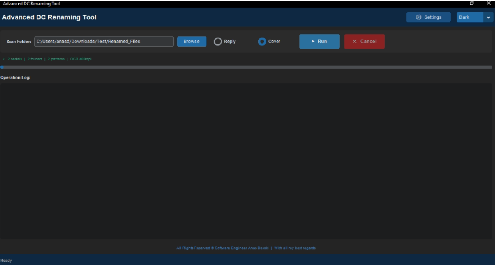

# AI-Powered PDF OCR & Auto-Renaming Engine

Desktop tool that reads serial numbers from scanned PDF submittals using OCR, matches them against a project database, and renames each file automatically. Ambiguous cases go to a manual review window.

## ⚠️ Repository Note
*This repository serves as a portfolio showcase of the architectural logic, OCR pipeline, and UI/UX design. The proprietary Python source code is withheld to protect intellectual property.*

## 🚧 The Problem
Document Control teams receive thousands of scanned PDFs (Submittals, IRs, RFIs) with generic scanner names (e.g., `Scan_20250512.pdf`). Opening every single file, visually locating the serial number, checking for the correct revision, and manually renaming the file to match the project's strict folder nomenclature is a massive bottleneck.

## 💡 The Solution & Core Features

### 1. Robust OCR Pipeline (OpenCV + Tesseract)
* **Dynamic Preprocessing:** Utilizes `cv2` to apply Bilateral filtering, Otsu thresholding, and adaptive deskewing to heavily distorted or scanned PDFs before passing them to the Tesseract engine.
* **Multi-Strategy Text Extraction:** Automatically falls back on different Page Segmentation Modes (PSM 11 → 3 → 6) and rotational checks (90°, 180°, 270°) to guarantee text extraction regardless of the document's orientation or layout.

### 2. Fuzzy Matching & Deduplication
* Compares extracted raw text against a dynamically built JSON database of the project's exact folder structures.
* Utilizes `difflib` for fuzzy string matching (handling typical OCR noise) and applies strict Regex pattern validation to ensure the matched serial complies with engineering standards.

### 3. Human-in-the-Loop (HITL) Validation
* **Smart Safety Flags:** The algorithm distinguishes between safe letter corrections (e.g., OCR reading '0' instead of 'O' in a letter segment) and dangerous digit corrections. Any ambiguity in numeric segments instantly halts the auto-rename process.
* **High-Res Zoom UI:** Ambiguous files are routed to a custom `customtkinter` Review Window. It renders a 400 DPI preview stored directly in memory, allowing users to zoom up to 6x seamlessly without quality loss to manually verify the serial number before proceeding.

### 4. High-Performance Concurrency
* Employs `ThreadPoolExecutor` to process multiple PDFs simultaneously, maximizing CPU usage while keeping the UI thread perfectly responsive.

## 🛠 Tech Stack
* **Computer Vision & OCR:** `pytesseract`, `OpenCV` (cv2), `numpy`, `pdf2image`, `Pillow` (PIL).
* **GUI Framework:** `customtkinter` for a highly responsive, modern dark-mode interface.
* **Concurrency:** Native `threading` and `concurrent.futures`.
* **Data Processing:** `re` (Regex) for dynamic serial pattern recognition, `json`, `difflib`.

## 📸 Interface Preview

